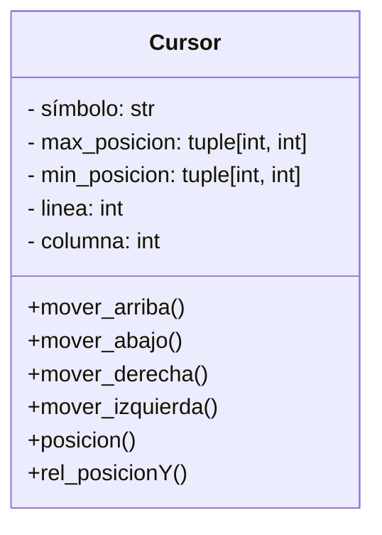
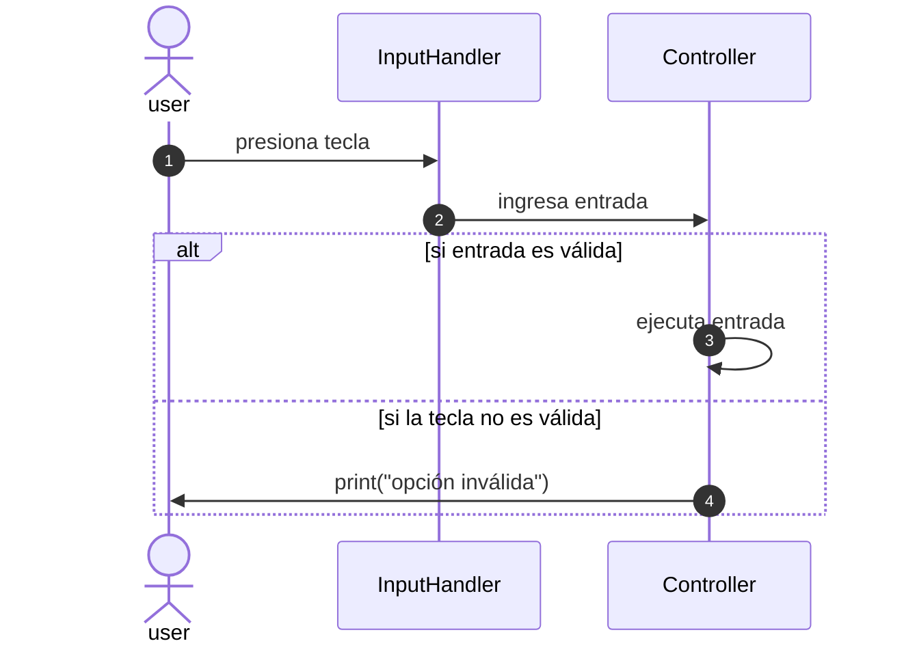
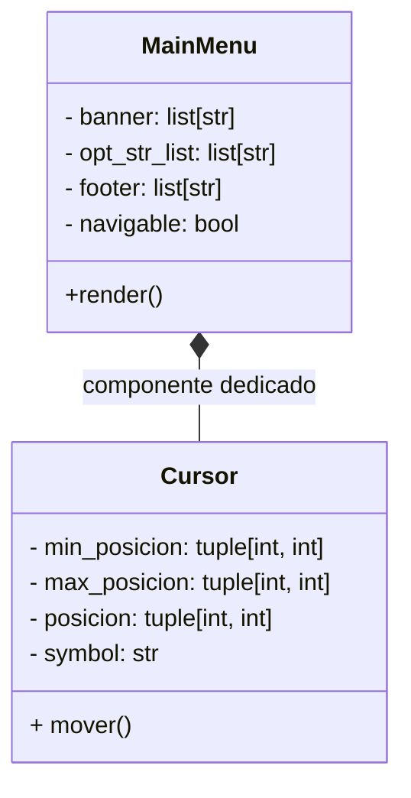

# OHM-TUI v1.0 🔋⚡

#### Demo video: https://www.youtube.com
#### Descripción:
OHM-TUI es una calculadora implementada en una interfaz de usuario basada en texto (de sus siglas en inglés TUI: Text User Interface), que permite editar y calcular de manera interactiva las fórmulas referentes a las leyes de Ohm. 

Su arquitectura está implementada a nivel de interprete, esto es, que no depende de frameworks como Rich o Textual, sino que consta de una arquitectura MVC dedicada, con la finalidad de ir más allá del rendimiento; como, por ejemplo, el aprendizaje de patrones de software y clases desacopladas (diseño modular).

## MODULOS IMPLEMENTADOS

### Terminal
Terminal es un módulo creado para manejar la impresion de secuencias ANSI usando lenguaje python; como, por ejemplo, la secuencia para limpiar pantalla (un equivalente a clear en linux o cls en windows).

**Secuencias implementadas:**

- Limpiar pantalla: "\33[2J"
- Mover cursor (línea, columna): f"\033[{line};{column}f"
- Ocultar Cursor: "\033[?25l"
- Mostrar Cursor: "\033[?25h"

**Combinación de secuencias:**

- Limpiar pantalla + Mover Cursor

### Cursor (selector de opción)
El cursor representa al típico puntero de opción en los menús que indica cual opción es la seleccionada.
Su icono puede ser un símbolo representativo que le indique al usuario en que opción está, ejemplos típicos son **>**, **>>** o **▶**. Para el presente proyecto se opta por el símbolo **>** con una motivación meramente estética.

#### Representación del cursor implementado.
Debido a la necesidad de implementar un proyecto de esta magnitud, se requirió modularizar cada componente de tal modo que sean independientes unos de otros. Para el caso de este módulo su representación UML es la siguiente:



### InputHandler
Para navegar en la TUI, se utiliza un módulo de lectura independiente, el cuál utiliza la biblioteca readchar para manejar un input continuo, sin las pausas necesarias que demanda el método input() nativo.

Este módulo está separado del Controlador (que se mostrará más adelante) debido a decisiones iniciales de implementación, en un refactor futuro puede agregarse al controller mediante un método estático.

#### Modelo secuencial de interacción 



### Menus
Una TUI siempre muestra al usuario una capa de visualización, que le permite al mismo manejarse entre las diversas opciones implementadas en dicha TUI. Por ejemplo el menú principal, que suele contener las opciones principales del sistema.

```bash
===========================================
               OHM-TUI v1.0
===========================================
> 1. Calcular Voltaje (V = I × R)
  2. Calcular Corriente (I = V / R)
  3. Calcular Resistencia (R = V / I)
  4. Info
  5. Ayuda
===========================================
subir/bajar [k/j] . Entrar [l] . Salir [q]
```

El menú mostrado, como ejemplo, consta de tres partes claramente segmentadas.
- Cabecera o banner
- Lista de opciones
- Pie o footer

Y aquí también podemos agregar un objeto que ya habíamos creado, como el cursor.

Es por ello que se decidió diseñar el objeto MainMenu de la siguiente manera:


Cómo se puede ver, el menú está compuesto de un cursor, esto desacopla eficientemente el renderizado de ambas instancias y mantiene una mejor arquitectura.

De la misma manera se crearon los siguientes menús: 
- MenuAyuda
- MenuInfo
- MenuCalcularVoltaje
- MenuCalcularCorriente
- MenuCalcularResistencia

Más adelante veremos cómo algunos menús están compuestos de otras instancias asociadas (como por ejemplo los menús de cálculo, que necesitan un modelo para renderizar parametros numéricos)


