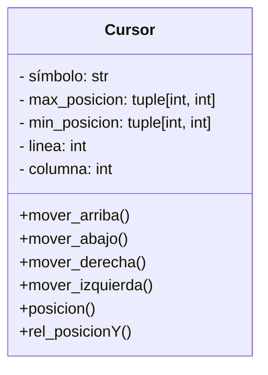
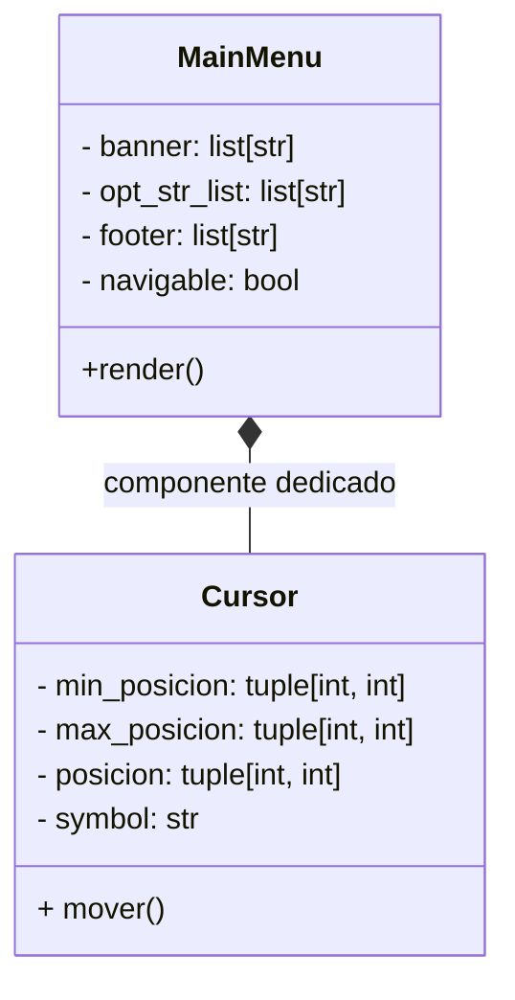
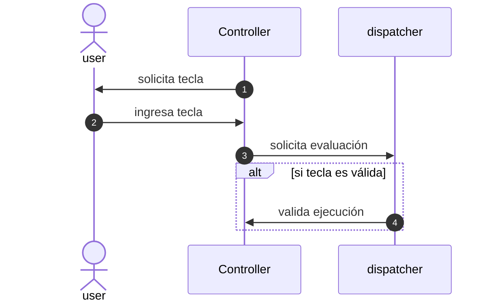
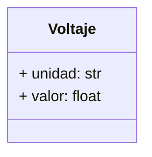
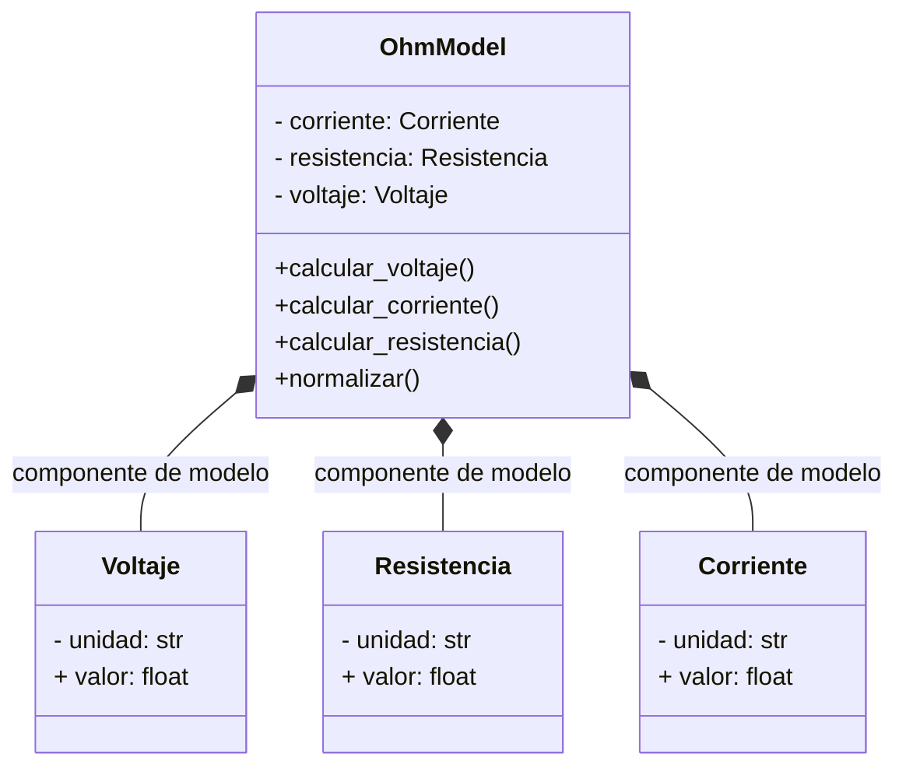
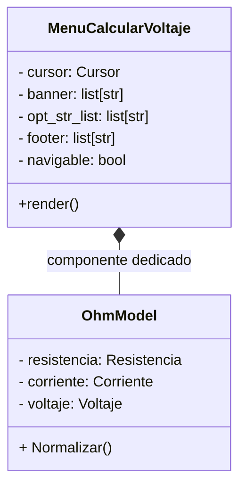

# OHM-TUI v1.0 🔋⚡

#### Demo video: https://www.youtube.com
#### Descripción:
OHM-TUI es una calculadora implementada en una interfaz de usuario basada en texto (de sus siglas en inglés TUI: Text User Interface), que permite editar y calcular de manera interactiva las fórmulas referentes a las leyes de Ohm. 

Su arquitectura está implementada a nivel de interprete, esto es, que no depende de frameworks como Rich o Textual, sino que consta de una arquitectura MVC dedicada, con la finalidad de ir más allá del rendimiento; como, por ejemplo, el aprendizaje de patrones de software y clases desacopladas (diseño modular).

## MODULOS IMPLEMENTADOS

### Terminal
Terminal es un módulo creado para manejar la impresion de secuencias ANSI usando lenguaje python; como, por ejemplo, la secuencia para limpiar pantalla (un equivalente a clear en linux o cls en windows).

**Secuencias implementadas:**

- Limpiar pantalla: "\33[2J"
- Mover cursor (línea, columna): f"\033[{line};{column}f"
- Ocultar Cursor: "\033[?25l"
- Mostrar Cursor: "\033[?25h"

**Combinación de secuencias:**

- Limpiar pantalla + Mover Cursor


### Cursor (selector de opción)
El cursor representa al típico puntero de opción en los menús que indica cual opción es la seleccionada.
Su icono puede ser un símbolo representativo que le indique al usuario en que opción está, ejemplos típicos son **>**, **>>** o **▶**. Para el presente proyecto se opta por el símbolo **>** con una motivación meramente estética.

#### Representación del cursor implementado.
Con la finalidad de implementar una arquitectura eficiente, se requirió modularizar el sistema en componentes separados con responsabilidad única. Para el caso de este módulo (cursor) se muestra la representación UML respectiva:



### Menus
Una TUI siempre muestra al usuario una capa de visualización, que le permite al mismo manejarse entre las diversas opciones implementadas en dicha TUI. Por ejemplo el menú principal, que suele contener las opciones principales del sistema.

```bash
===========================================
               OHM-TUI v1.0
===========================================
> 1. Calcular Voltaje (V = I × R)
  2. Calcular Corriente (I = V / R)
  3. Calcular Resistencia (R = V / I)
  4. Info
  5. Ayuda
===========================================
subir/bajar [k/j] . Entrar [l] . Salir [q]
```

El menú mostrado, como ejemplo, consta de tres partes claramente segmentadas.
- Cabecera o banner
- Lista de opciones
- Pie o footer

Y aquí también podemos agregar un objeto que ya habíamos creado, el cursor de selección.

Es por ello que se decidió diseñar el objeto MainMenu de la siguiente manera:

Este diseño desacopla el estado del menú del cursor, generando una arquitectura más limpia y funcional.

De la misma manera se crearon los siguientes menús: 
- MenuAyuda
- MenuInfo
- MenuCalcularVoltaje
- MenuCalcularCorriente
- MenuCalcularResistencia

Más adelante veremos cómo algunos menús están compuestos de otras instancias asociadas (como por ejemplo los menús de cálculo, que necesitan un modelo para renderizar parametros numéricos)


### Controlador
Para generar una interacción entre los componentes mencionados, se decidió crear una clase Controller, cuyo objetivo es el de orquestar el flujo desacoplado y eficiente de cada componente involucrado.

##### Modelo secuencial de interacción 


Las acciones implementadas para el presente proyecto son las siguientes:
- Mover cursor abajo
- Mover cursor arriba
- Apilar nuevo menú
- Desapilar último menú
- Salir del programa
- Ir al menú de ayuda

#### Mover cursor
Como se mencionó en el apartado de cursor, este cuenta con métodos que permiten modificar su tupla de posición, donde el primer elemento representa la línea (Y) y el segundo elemento la columna (X).

#### Pila de menús
De nada serviría implementar varios menús, si no tenemos una manera de ordenarlos acorde a lo que el usuario requiera. Es por ello que se opta usar pilas tipo LIFO (Last In First Out), donde cada menu es un elemento de la pila. 

Imaginemos que estamos en el main menu, y el usuario selecciona la opción **1.0** (Calcular Voltaje), entonces el menú que debe apilarse sería MenuCalcularVoltaje. Quedando la pila de la siguiente manera.

```text
  Pila: menu_stack[MainMenu(), MenuCalcularVoltaje(), ...]
        +-------------------------+
        |           ...           | -> render()
        +-------------------------+
        |   MenuCalcularVoltaje   | -> render()
        +-------------------------+
        |        MainMenu         | -> render()
        +-------------------------+
```

El controlador por defecto siempre inicializa con un MainMenu() en su pila (una lista de menús) y el proceso de apilar y desapilar corresponde a métodos append y pop nativos de python para manipular listas.

#### Edición de parámetros
En algunos menús, es necesario modificar parámetros, para mantener una interacción cómoda se opta por usar el cursor (por ejemplo █) y dar un salto hacia el punto de edición. De esta manera, con una tecla podemos activar el modo edición.
```text
====================================
         CÁLCULO DE VOLTAJE
====================================
> 1.1. Corriente (I)    : █.0
  1.2. Resistencia (R)  : 0.0
-----------------
  Resultado (V)         : 0.0
====================================
Editar [l] . Volver [h] . Ayuda [?]
```

### Modelo
El modelo, aislado totalmente de los otro módulos, se encarga de ejecutar los cálculos y modelamiento de componentes necesarios para obtener resultados de negocio.

En este caso, para el proyecto se decide utilizar un modelo sencillo, que nos permita eliminar toda complejidad mientras se refactorizan el proyecto. Claro está que una vez maduro el proyecto, el modelo puede ser reemplazado por otro, como un calculador de circuitos RC.

De acuerdo con lo mencionado se muestra un ejemplo de parámetro circuital del sistema:


#### Normalización de parámetros
Es muy conocido , en el ambito profesional, que la representación científica de un parámetro es más que añadirle la unidad de medida al lado derecho (e.g. 0.001 A), ya que suponiendo querramos representar un número extremadamente pequeño ocupariamos gran espacio en solo digitar los decimales de dicho número. Es por ello que los prefijos del sistema internacional son tan útiles en estos casos.

Por ejemplo supongamos que queremos representar la millonesima parte de una corriente electrica que fluye por una resistencia.

corriente si prefijos SI:  
$$
c1 = 0.000001 A
$$

corriente con prefijos SI: 
$$
c1 = 1 uA
$$

Para el presente proyecto se ha implementado un método de normalización de parámetros dentro de la clase OhmModel. Cuya lógica se actual es simple y directa, multiplicando o dividiendo iteradamente hasta obtener una mantiza entre 1 y 999.

```python
while numero <= 1:
    numero *= 1000
    exponente -= 3
while numero >= 999:
    numero /= 1000
    exponente += 3
```

El exponente resultante es convertido a su símbolo prefijo SI, mediante un diccionario:

```python
si_exp = {
        -30: 'q', -27: 'r', -24: 'y', -21: 'z', -18: 'a', -15: 'f', -12: 'p', -9: 'n', -6: 'u', -3: 'm',
        0: '',
        3: 'k', 6: 'M', 9: 'G', 12: 'T', 15: 'P', 18: 'E', 21: 'Z', 24: 'Y', 27: 'R', 30: 'Q'
        }
```

#### Modelo Final
Finalmente, integrando cada parte del modelo, se muestra su representación completa.



#### Integración del modelo en los menús.
Como se mencionó en el apartados anteriores, algunos menús tienen integrados más componentes. Por ejemplo para los menús de cálculo, se utiliza el módulo de modelo.

## Tests
Para probar exhaustivanente el flujo dw funcionamiento de la TUI se hizo uso de parametrize, la cual es una herramienta que nos permite realizar pruebas iterativas con distintas combinaciones de entradas posible.

Por ejemplo, para verificar el funcionamiento del cursor implementado. Se prueban distintas combinaciones de movimiento.

```python
data_mover_cursor = [
        (['k'], (1, 1)),
        (['k', 'j'], (2, 1)),
        (['k', 'j', 'j'], (3, 1)),
        (['k', 'j', 'j', 'j'], (4, 1)),
        (['k', 'j', 'j', 'j', 'j'], (5, 1)),
        (['k', 'j', 'j', 'j', 'j', 'j', 'j'], (5, 1)),
        ]
@pytest.mark.parametrize("secuencia_de_movimiento, posicion_cursor", data_mover_cursor)
def test_mover_cursor(secuencia_de_movimiento, posicion_cursor):
    posicion_final = mover_cursor(secuencia_de_movimiento)

    assert posicion_final == posicion_cursor
```
Este tipo de parametrización no se sería posible sin los wrappers implementados en el archivo principal project.py.

Por ejemplo para los test anteriores se usa el wraper mover_cursor(), que simula leer una secuencia de teclas ingresadas por un usuario; para finalmente comprobar la posición del cursor (tupla) al terminar dicha secuencia.

```python
def mover_cursor(secuencia_entrada: list[str]) -> tuple[int, int]:
    controller = Controller()
     
    for tecla_entrada in secuencia_entrada:
        controller.kb_val = tecla_entrada
        controller.exec_kb()
     
    return controller.menu_stack[-1].cursor.posicion 
```

## Estructura de archivos
- project.py: archivo principal, que maneja al controlador del proyecto implementado.
- README.md: archivo de información del proyecto implementado, detalla cada módulo y su funcionamiento, muestra diagramas UML y código de testing.
- requirements.txt: contiene una sola librería (readchar), la cuál es necesaria para leer entradas sin una pausa de entrada típica como el stdin.
