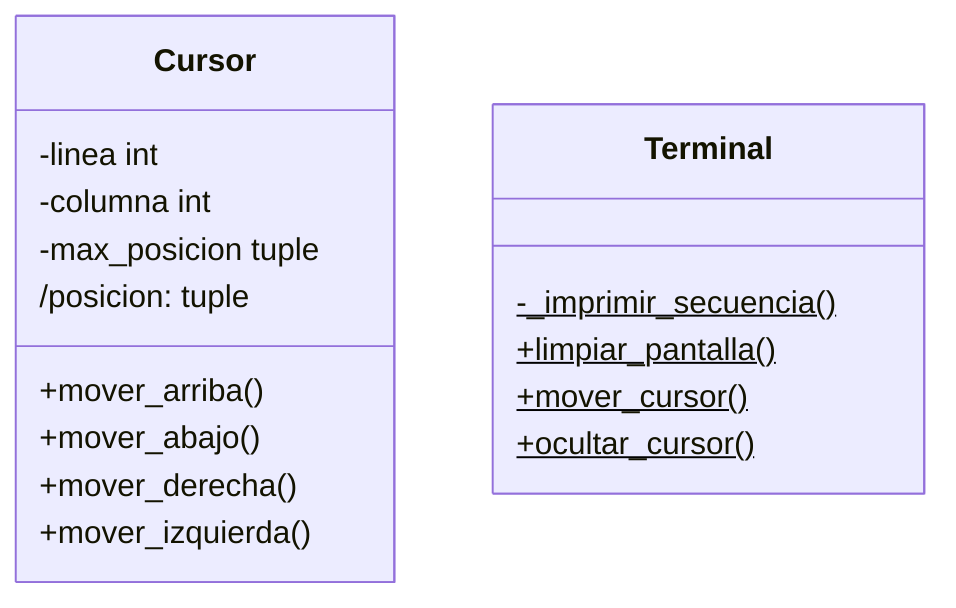
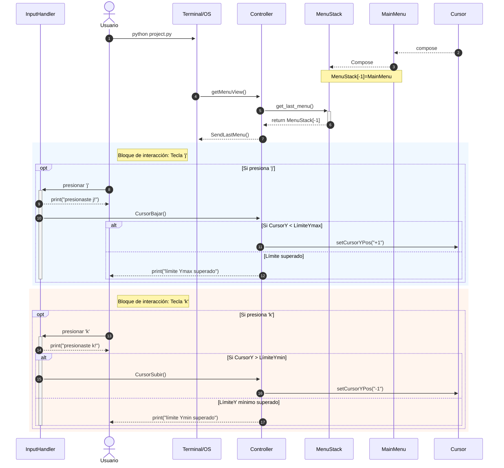

# Diagramas UML

## Diagramas de Clase

```mermaid
classDiagram
    class Cursor{
        -linea int
        -columna int
        -max_posicion tuple
        /posicion:  tuple

        +mover_arriba()
        +mover_abajo()
        +mover_derecha()
        +mover_izquierda()
    }

    class Terminal{
        -_imprimir_secuencia()$
        +limpiar_pantalla()$
        +mover_cursor()$
        +ocultar_cursor()$
    }
```
## Diagramas de secuencia:

```mermaid
sequenceDiagram
autonumber
   participant InputHandler
   actor Bernard as Usuario
   participant kitty as Terminal/OS
   participant Controller
   participant MenuStack
   participant MainMenu
   participant Cursor
   

   Bernard->>+kitty: python project.py

   Cursor-->>MainMenu: compose
   MainMenu-->>MenuStack: Compose
   Note over MenuStack, MainMenu: MenuStack[-1]=MainMenu
   kitty->>+Controller:  getMenuView()

   Controller->>+MenuStack: get_last_menu()
   MenuStack-->>-Controller:  return MenuStack[-1]

   Controller-->>kitty: SendLastMenu()

   rect rgb(240, 248, 255)
   Note right of Bernard: Bloque de interacción: Tecla 'j'
   opt Si presiona 'j'
      Bernard->>+InputHandler: presionar 'j'
      InputHandler-->>Bernard: print("presionaste j!")
      InputHandler->>Controller: CursorBajar()
      alt Si CursorY < LímiteYmax
         Controller->>Cursor: setCursorYPos("+1")
      else Límite superado
         Controller-->>Bernard: print("límite Ymax superado")
      end
      deactivate InputHandler
   end
   end

   rect rgb(255, 245, 238)
   Note right of Bernard: Bloque de interacción: Tecla 'k'
   opt Si presiona 'k'
      Bernard->>+InputHandler: presionar 'k'
      InputHandler-->>Bernard: print("presionaste k!")
      alt Si CursorY > LímiteYmin
         InputHandler->>Controller: CursorSubir()
         Controller->>Cursor: setCursorYPos("-1")
      else LímiteY mínimo superado
         Controller-->>Bernard: print("límite Ymin superado")
      end
      deactivate InputHandler
   end
   end
```
